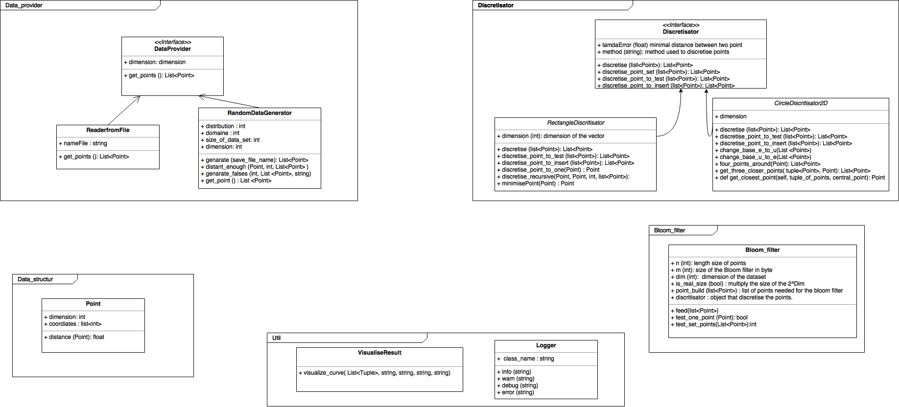

# Multidimentional Bloom filter


## Project presentation
<p>
	A Bloom filter is a simple, space-efficient, randomized data structure that allows to answer set membership queries on a set with a small and controlled probability of getting false positive. It is composed of a bit table and hash functions.
</p>
<p>
The aim of the project is to succesfully build a multidimentional Bloom filter distance sensitive that allow to answser to query "Does V contain an element close x" where x is a vector belong to U and V is a sub-space of U. 
	Other techniques have been thought to solve the probleme but none of them remain privacy preversing while keeping the inital advantages of the bloom filter.
</p>
To resolve the problem we use different methods to discretize the space:
<u>
<li> a square method; We split each dimention and keep only the closest points </li>
<li> a circle method; We suround each point and keep only the intersection (only working in dimension 2)</li>
</u>

## Project organisation

Inline-style: 



## Prerequisites

In order to use our solution, you need to have python 3.x installed on your machine. We haven't tested our solution for previous version. To check your version use:

```
python --version
```

## Installing
You will need to install bloom_filter [library](https://pypi.python.org/pypi/bloom-filter/1.3) already present in python

```
pip3 install bloom_filter
```

## Running the tests

First you will need to install the library used to create the test set.

```
pip3 install unittest
```

Then execute the following command to run the tests.

```
python -m unittest discover -s tests
```

## How to use it

-  First you will need to get the source code

```
git clone https://github.com/jfolleas1/ProjetSpecifique.git
```

- You should copy the src folder of the current project in your python project.
- Choose your discritisator : 
	- 	delta_error = The maximum distance between two elements

```python
	from [path to src] src.discretisator.RectangleDiscretisator import RectangleDiscretisator
	[...]
	discritisator =  RectangleDiscretisator(delta_error)
```	

OR

```python
	from [path to src] src.discretisator.RectangleDiscretisator import CircleDiscretisator
	[...]
	discritisator = CircleDiscretisator(delta_error)	
```

- To use our distance sensitive Bloom filter, use the following line of codes:
	- list_point_feed = list of point that we used to build the Bloom filter.
	- list_point_test = list of point that we want to test.
	- discritisator = method of discritisation used.
	- nb_point_in_bloom_filter = number of point tested that is close to other point present in the initial dataset
	- m = size of the bloom filter in bit.

```python
from [path to src]src.BloomFilter.BloomFilterTester import 

[...]

bloom_filter_distance_sensitive = BloomFilterTester(len(list_point_feed), m, list_point_feed, discritisator1)
nb_point_in_bloom_filter = bloom_filter.test_set_points(list_point_test, discritisator2)
```


## Contributing

When contributing to this repository, please first discuss the change you wish to make via issue, email, or any other method with the owners of this repository before making a change.

Please note we have a code of conduct, please follow it in all your interactions with the project.

###Pull Request Process

- Ensure any install or build dependencies are removed before the end of the layer when doing a build.
- Update the README.md with details of changes to the interface, this includes new environment variables, exposed ports, useful file locations and container parameters.
- You may merge the Pull Request in once you have the sign-off of two other developers, or if you do not have permission to do that, you may request the second reviewer to merge it for you.

## Authors

* **Jacques Folleas** - [Github profile](https://github.com/jfolleas1)
* **Gabriel Specq** - [Github profile](https://github.com/gabsSP1)
* **Arnaud Dupeyrat** - [Github profile](https://github.com/jfolleas1) </br>
See also the list of [contributors](https://github.com/jfolleas1/ProjetSpecifique/graphs/contributors) who participated in this project.
